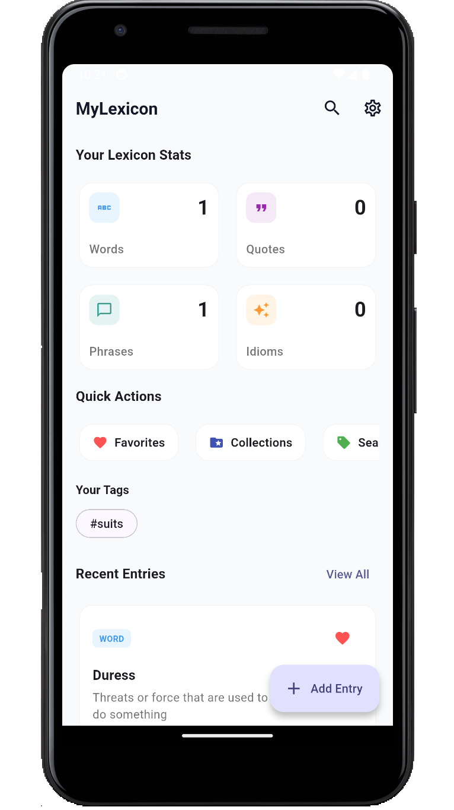
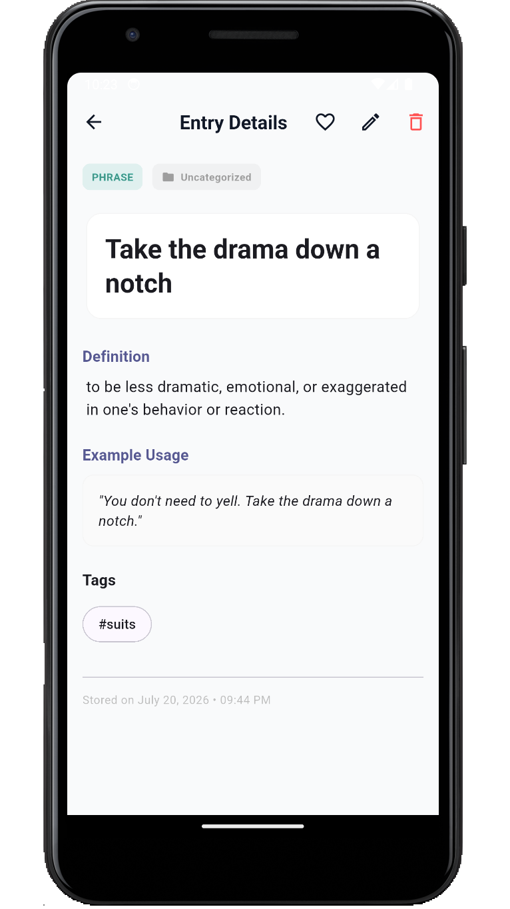
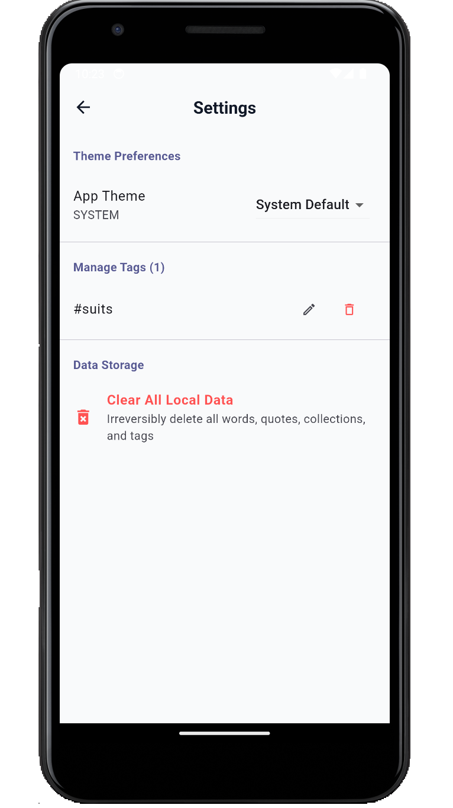

# My Lexicon

My Lexicon is an open-source Flutter app for saving and organizing things you want to learn. It is designed as a personal knowledge companion where you can store words, quotes, phrases, idioms, notes, tags, favorites, and collections in one place.

The app follows a feature-first architecture and keeps data locally on the device, making it a lightweight way to build your own learning library without relying on a remote backend.

## Screenshots

| Home | View | Settings |
| --- | --- | --- |
|  |  |  |


## Features

- Save learning items as words, quotes, phrases, or idioms.
- Add definitions, examples, notes, tags, and collections.
- Mark items as favorites for quick access.
- Search and filter entries by text, type, tags, collections, and favorites.
- Organize content with a clean, offline-first local database.
- Switch between light, dark, and system themes.

## Tech Stack

- Flutter
- Riverpod for state management
- GoRouter for navigation
- Hive for local storage
- Shared Preferences for settings persistence

## Project Structure

```text
lib/
├── core/
│   ├── constants/
│   ├── services/
│   ├── theme/
│   └── utils/
├── features/
│   ├── collections/
│   ├── dictionary/
│   ├── home/
│   ├── idioms/
│   ├── phrases/
│   ├── quotes/
│   ├── search/
│   └── settings/
├── models/
├── routes/
├── widgets/
└── main.dart
```

## Getting Started

### Prerequisites

- Flutter SDK
- Dart SDK compatible with the project constraints
- An Android emulator, iOS simulator, or physical device

### Run Locally

```bash
flutter pub get
flutter run
```

### Generate Local Adapters

If you make changes to Hive models, regenerate the adapters:

```bash
flutter pub run build_runner build --delete-conflicting-outputs
```

## Why This App Exists

This project is intended to help people learn by capturing useful knowledge as they discover it. Instead of scattering notes across multiple apps, My Lexicon provides a focused place to save, revisit, and organize learning material over time.

## Contributing

Contributions are welcome. If you want to improve the app, please open an issue or submit a pull request.

Please keep changes aligned with the existing feature-first structure and local-first design.

## License

This project is licensed under the MIT License. See [LICENSE](LICENSE) for details.