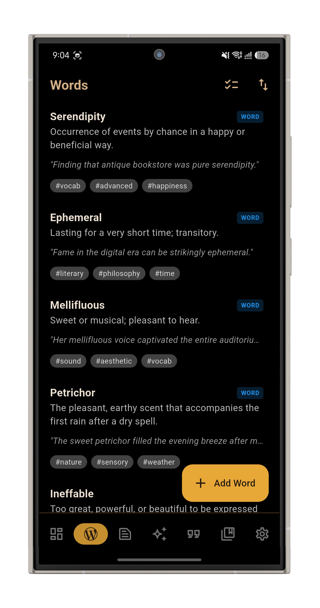
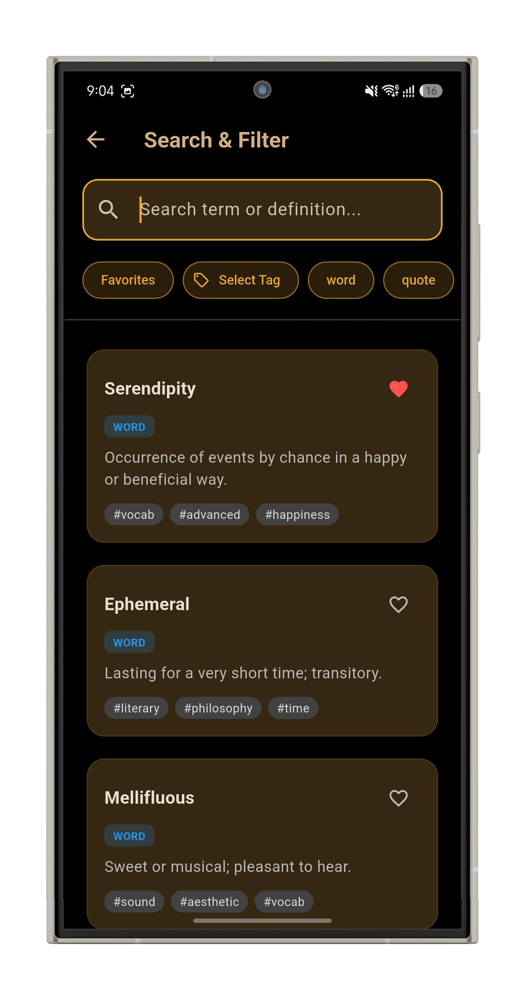
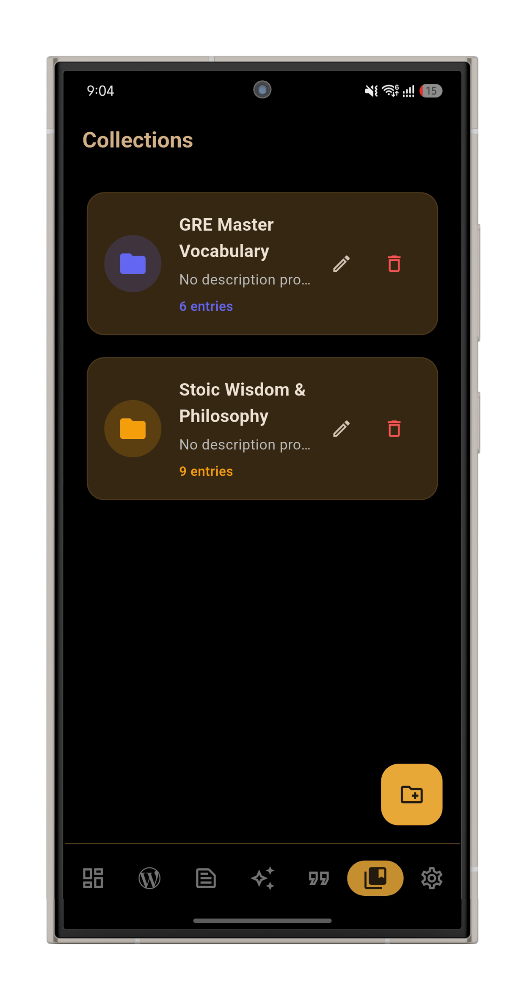

<div align="center">


## My Lexicon

**Your personal offline dictionary & vocabulary companion — built for privacy.**

A privacy-first personal dictionary for Android — save words, quotes, phrases, idioms, and collections, all stored locally on your device. No account. No cloud. No tracking.

<br/>

[](https://github.com/aryany9/MyLexicon/releases/latest)
&nbsp;
[](https://f-droid.org/packages/com.aryanyadav.mylexicon)
&nbsp;
[](LICENSE)

<br/>

[**Download APK**](https://github.com/aryany9/MyLexicon/releases/latest) · [**Get on F-Droid**](https://f-droid.org/packages/com.aryanyadav.mylexicon) · [**Add via Obtainium**](https://apps.obtainium.imranr.dev/redirect.html?r=obtainium://add/https://github.com/aryany9/MyLexicon)

</div>

---

## Screenshots

<div align="center">
  
  
  
  
  
</div>

---

## Why My Lexicon?

Most dictionary apps are either cloud-dependent, subscription-gated, or cluttered with ads. My Lexicon is different — it's a **personal knowledge companion** you fully own.

- 📖 Save **words, phrases, idioms, quotes** — all in one place
- 🔒 Everything stays **on your device** — Hive database, zero cloud
- 🎨 **Looks great** — Material 3, named theme palettes, AMOLED support
- ⚡ **Fast and lightweight** — no login screen, no sync spinner, just your words

---

## Features

### 🗂 Organize Everything
- **5 content types** — Words, Phrases, Idioms, Quotes, and Collections
- **Tags** — label and filter entries your way
- **Collections** — group related entries into named sets
- **Favorites** — star anything for quick access
- **Multi-select batch delete** — long-press to select, delete in bulk

### 🎨 Make It Yours
- **8+ theme palettes** — Default, Solarized, Abyss, Kimbie Dark, Monokai, One Light, Quiet Light, and more
- **Independent light & dark palettes** — different palette for each mode
- **AMOLED black** — true black for OLED displays
- **3 list densities** — Compact, Comfortable, Detailed
- **Reorderable tabs** — drag navigation tabs into your preferred order
- **Toggle any category** — hide what you don't use

### 🔍 Find Anything Fast
- **Full-text search** across all entry types
- **Per-tab sorting** — Newest, Oldest, A–Z, Z–A independently per category
- **Filter by favorites, tags, or collections**

### 💾 Own Your Data
- **JSON backup & restore** — full database export with conflict resolution (Skip / Overwrite / Merge)
- **CSV export & import** — compatible with spreadsheet apps, preserves collection structure
- **Duplicate detection** — collection-aware duplicate warnings at save time
- **No account required** — ever

---

## Tech Stack

Built with Flutter using a clean feature-first architecture.

| | |
|---|---|
| **UI Framework** | Flutter + Material 3 |
| **State** | Riverpod |
| **Navigation** | GoRouter (shell route) |
| **Database** | Hive (local, offline) |
| **Theming** | Custom `AppThemeRegistry` with named palettes |
| **Platform** | Android · Min SDK 21 |

---

## Getting Started

```bash
git clone https://github.com/aryany9/MyLexicon.git
cd MyLexicon
flutter pub get
flutter run
```

For release builds:
```bash
flutter build apk --release --split-per-abi
```

> Read [`AGENTS.md`](AGENTS.md) before contributing — it documents versioning, F-Droid conventions, back navigation rules, and commit style.

---

## Contributing

Found a bug? Have a feature idea? All contributions are welcome.

1. Fork → branch → commit (follow [Conventional Commits](https://www.conventionalcommits.org/))
2. Open a PR against `main`
3. [Open an issue](https://github.com/aryany9/MyLexicon/issues) for bugs or ideas

---

## License

Apache 2.0 — see [LICENSE](LICENSE).

---

<div align="center">

Made with ❤️ in India &nbsp;·&nbsp; [⭐ Star if you find it useful](https://github.com/aryany9/MyLexicon/stargazers)

</div>