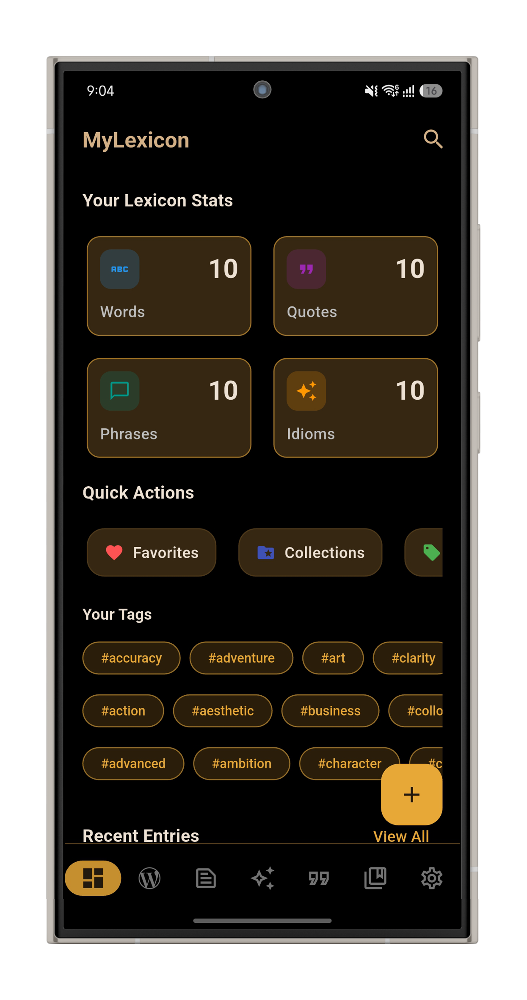
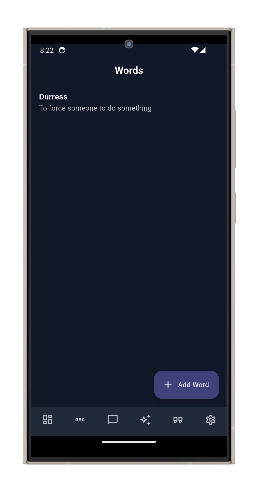
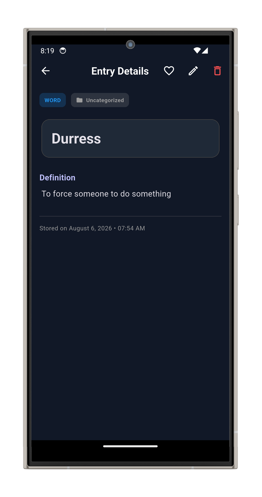
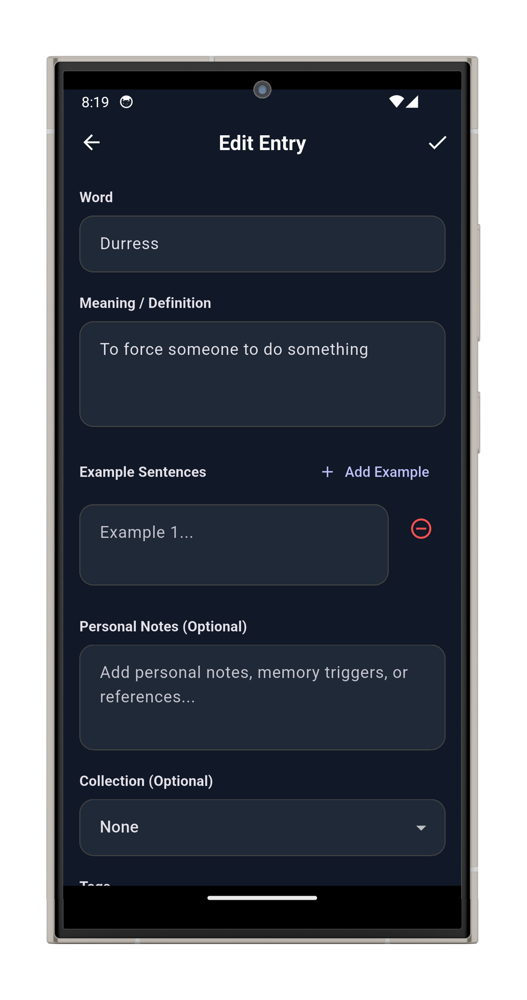
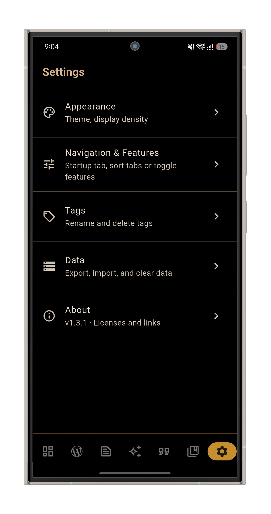

<div align="center">


# My Lexicon

### A modern and beautiful offline-first dictionary, learning, and vocabulary organizer app!

[](https://github.com/aryany9/MyLexicon/releases/latest)

</div>

My Lexicon is an open-source Flutter app for saving and organizing things you want to learn. It is designed as a personal knowledge companion where you can store words, quotes, phrases, idioms, notes, tags, favorites, and collections in one place.

The app follows a feature-first architecture and keeps data locally on the device, making it a lightweight way to build your own learning library without relying on a remote backend.

# Table of Contents
- [Features](#features)
- [Screenshots](#screenshots)
- [Tech Stack](#tech-stack)
- [Contributing](#contributing)
- [License](#license)

## Features

- **Personal Learning Library**: Save learning items categorized as words, quotes, phrases, or idioms.
- **Rich Entry Attributes**: Add definitions, multiple example sentences, personal notes, tags, and custom collections.
- **Smart Duplicate Prevention**: Real-time inline duplicate term detection warning during entry creation.
- **Contextual Actions**: Fan-out floating action button on Dashboard and contextual type-specific add buttons in category lists.
- **Import & Export Data**: Changing device? or keeping backup? You are all set with one tap export and import in settings
- **Favorites & Navigation**: Mark items as favorites for quick access and configure your default app-launch tab.
- **Powerful Search**: Search and filter entries dynamically by text, type, tags, collections, and favorites.
- **Offline-First & Local**: Secure, lightweight local storage on your device with JSON and CSV export/import options.
- **Modern Themes**: Clean UI with support for light, dark, and system default themes.

## Screenshots

<div align="center">
  <p float="left">
    
    
    
    
    
  </p>
</div>

## Tech Stack

- **Framework**: Flutter
- **State Management**: Riverpod
- **Routing & Navigation**: GoRouter
- **Local Storage**: Hive
- **Settings Persistence**: Shared Preferences

## Project Structure

```text
lib/
├── core/
│   ├── constants/
│   ├── services/
│   ├── theme/
│   └── utils/
├── features/
│   ├── collections/
│   ├── dictionary/
│   ├── home/
│   ├── idioms/
│   ├── phrases/
│   ├── quotes/
│   ├── search/
│   └── settings/
├── models/
├── routes/
├── widgets/
└── main.dart
```

### Generate Local Adapters

If you make changes to Hive models, regenerate the adapters:

```bash
flutter pub run build_runner build --delete-conflicting-outputs
```

## Contributing

Contributions are welcome. If you want to improve the app, please open an issue or submit a pull request.

Please keep changes aligned with the existing feature-first structure and local-first design.

## License

This project is licensed under the Apache License, Version 2.0. See [LICENSE](LICENSE) for details.