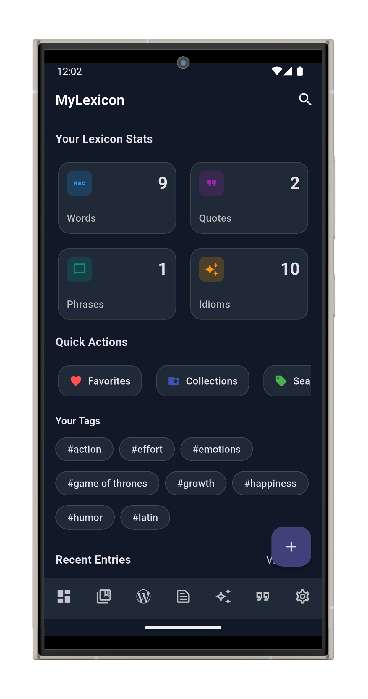
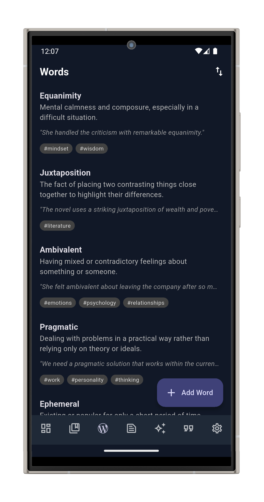
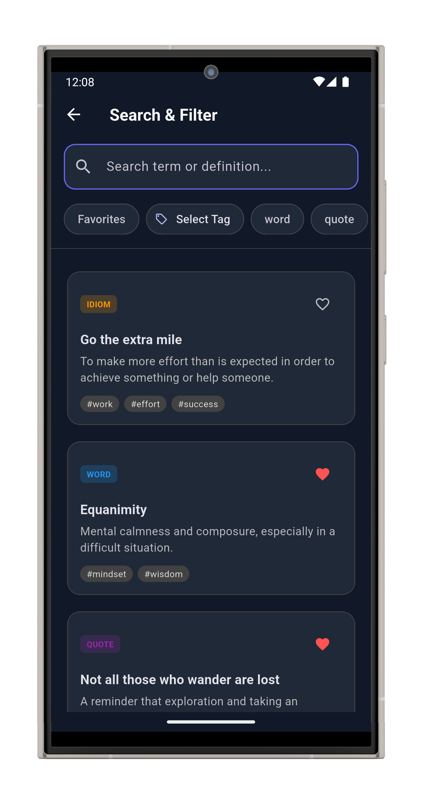
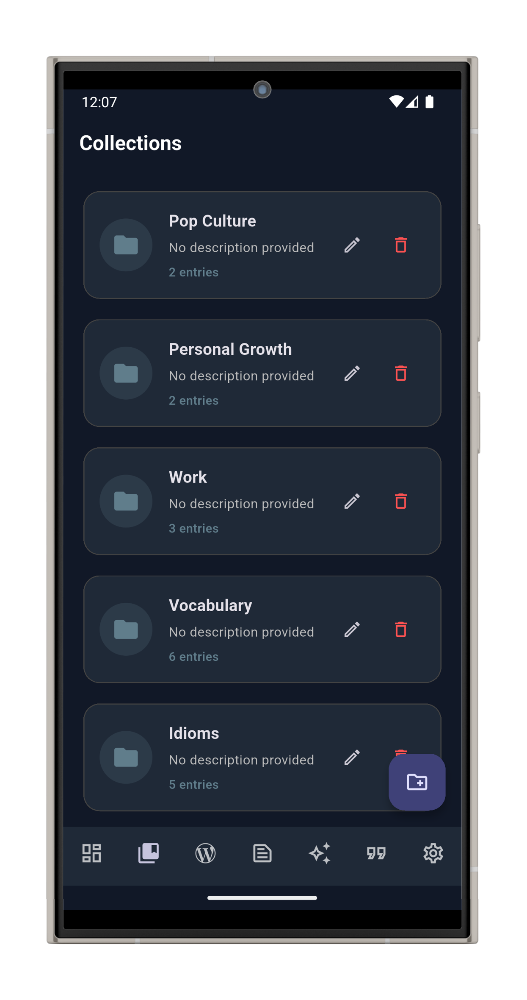
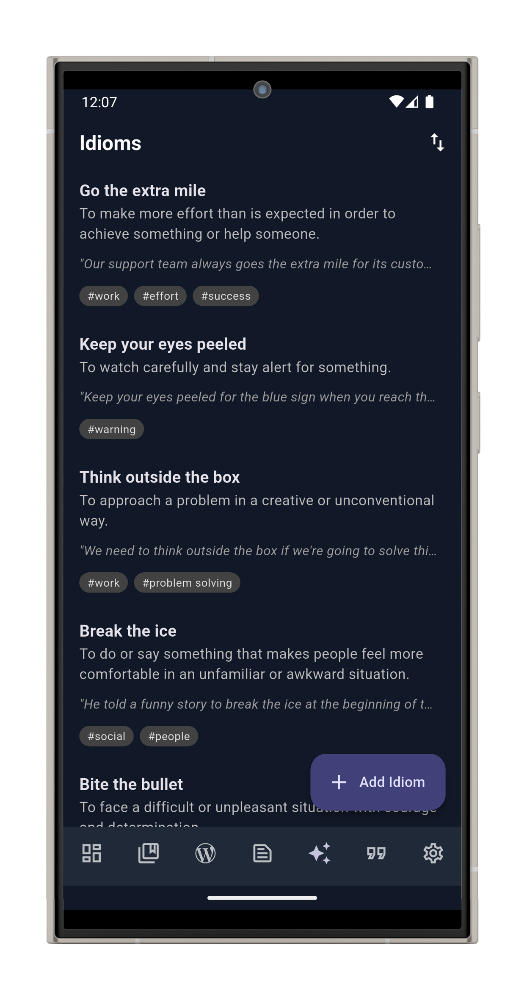
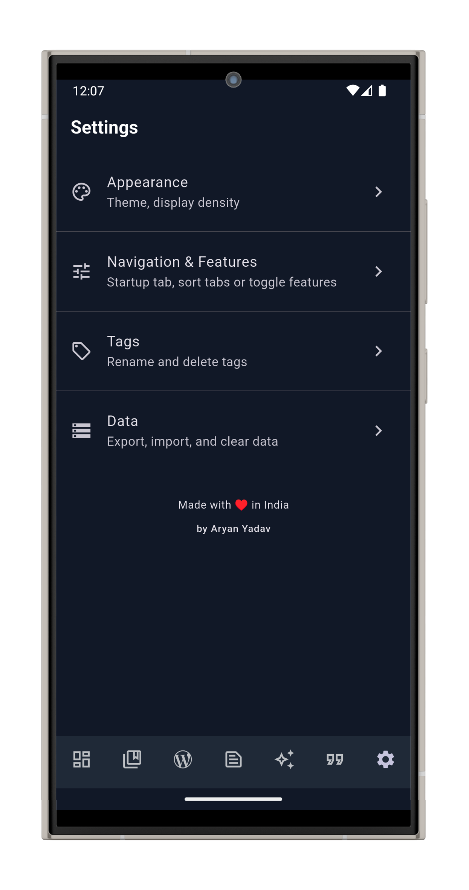
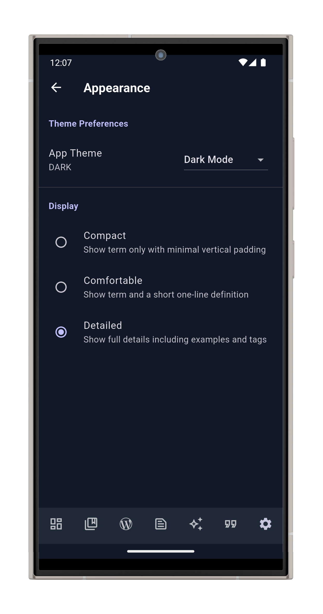
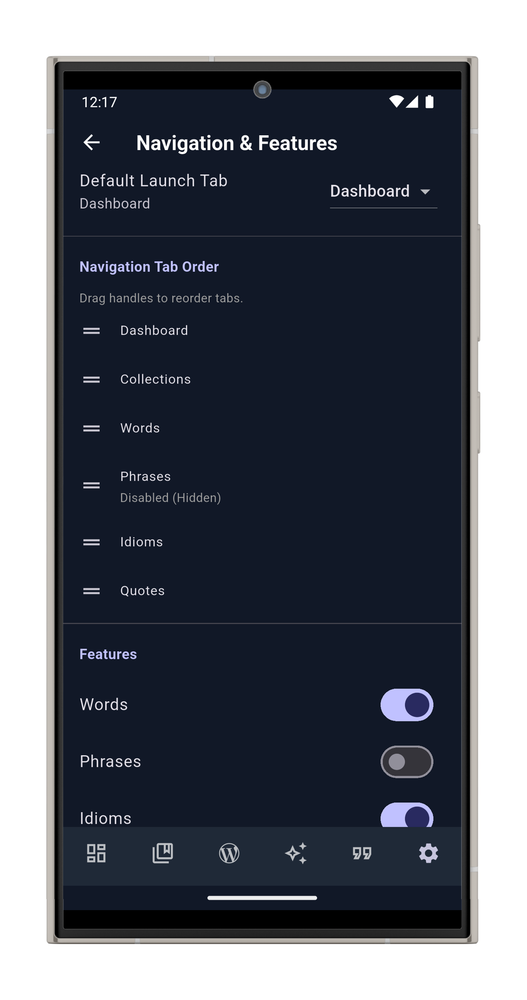

<div align="center">


# My Lexicon

### A modern, beautiful, offline first and open-source Android dictionary & vocabulary builder app!

[](https://github.com/aryany9/MyLexicon/releases/latest)

</div>

**My Lexicon** is a powerful **open-source alternative for "Create Dictionary" application**. Designed specifically for Android, it serves as an offline-first personal knowledge companion where you can create, organize, and master words, quotes, phrases, idioms, personal notes, tags, favorites, and custom collections.

The app follows a feature-first architecture, uses OpenSpec spec-driven design, and keeps all your data stored 100% locally on your Android device — offering a privacy-respecting, lightweight solution to building your custom dictionary without relying on any cloud backend.

# Table of Contents
- [My Lexicon](#my-lexicon)
    - [A modern, beautiful, offline first and open-source Android dictionary \& vocabulary builder app!](#a-modern-beautiful-offline-first-and-open-source-android-dictionary--vocabulary-builder-app)
- [Table of Contents](#table-of-contents)
  - [Features](#features)
  - [Screenshots](#screenshots)
  - [Tech Stack](#tech-stack)
  - [Project Architecture \& OpenSpec Specs](#project-architecture--openspec-specs)
    - [OpenSpec Specifications Directory (`openspec/specs/`)](#openspec-specifications-directory-openspecspecs)
  - [Getting Started \& Building for Android](#getting-started--building-for-android)
    - [Prerequisites](#prerequisites)
    - [Steps to Setup and Build](#steps-to-setup-and-build)
  - [Contributing](#contributing)
  - [License](#license)

## Features

- 📚 **Create Your Own Dictionary**: Build a custom offline dictionary with words, quotes, phrases, and idioms.
- 🎛️ **Modular Feature Toggles**: Enable or disable any category (`Words`, `Phrases`, `Idioms`, `Quotes`) or `Collections` system-wide. Disabled features cleanly disappear from navigation, dashboard, entry forms, and search filters.
- 🔀 **Custom Navigation Bar Reordering**: Drag and reorder bottom navigation tabs (`Dashboard`, `Words`, `Phrases`, `Idioms`, `Quotes`, `Collections`) directly in Settings, with `Settings` pinned as the final tab.
- 📱 **Reorganized Nested Settings**: Clean navigation sub-pages (Appearance, Navigation & Features, Tags, Data) for an intuitive, clutter-free settings experience.
- ↕️ **Per-Tab Independent Entry Sorting**: Sort each category tab independently by *Newest First*, *Oldest First*, *A–Z*, or *Z–A*.
- 📐 **Global List Density Control**: Customize entry card density across all lists with *Compact*, *Comfortable*, or *Detailed* display options.
- 🛡️ **Smart Duplicate Prevention**: Collection-aware duplicate term detection at save time with inline warnings and direct navigation to existing entries.
- 📦 **Data Import & Export**: One-tap full JSON backup & restore plus CSV spreadsheet export/import with collection membership preservation.
- ⚡ **Contextual Actions**: Dynamic fan-out floating action button on Dashboard and contextual type-specific add actions.
- ⭐ **Favorites & Quick Access**: Mark entries as favorites and configure your default app-launch tab.
- 🔍 **Powerful Search**: Search and filter entries dynamically by text, type, tags, collections, and favorites.
- 🔒 **Offline-First & Local**: Secure, lightweight local storage powered by Hive (no login required).
- 🎨 **Modern Themes**: Clean UI with support for light, dark, and system default themes.

## Screenshots

<div align="center">
  <p float="left">
    
    
    
    
    
    
    
    
  </p>
</div>

## Tech Stack

- **Target Platform**: Android (solely targeted)
- **Framework**: Flutter
- **State Management**: Riverpod
- **Routing & Navigation**: GoRouter
- **Local Storage**: Hive
- **Settings Persistence**: Shared Preferences
- **App Launcher Icons**: Flutter Launcher Icons

## Project Architecture & OpenSpec Specs

My Lexicon uses a **feature-first architecture** and follows **OpenSpec spec-driven development** for change management and capability specifications.

```text
lib/
├── core/
│   ├── constants/
│   ├── models/
│   │   └── app_feature.dart
│   ├── providers/
│   │   ├── display_preferences_provider.dart
│   │   ├── feature_flags_provider.dart
│   │   ├── sort_order_provider.dart
│   │   ├── tab_order_provider.dart
│   │   └── tab_provider.dart
│   ├── services/
│   ├── shell/
│   │   └── app_shell.dart
│   └── theme/
├── features/
│   ├── collections/
│   ├── dictionary/
│   ├── home/
│   ├── idioms/
│   ├── phrases/
│   ├── quotes/
│   ├── search/
│   └── settings/
│       ├── import_preview_screen.dart
│       ├── settings_screen.dart
│       └── sub_pages/
│           ├── appearance_settings_page.dart
│           ├── data_settings_page.dart
│           ├── navigation_settings_page.dart
│           └── tags_settings_page.dart
├── models/
├── routes/
├── widgets/
└── main.dart
```

### OpenSpec Specifications Directory (`openspec/specs/`)

System capabilities and behavioral constraints are documented in spec-driven markdown under `openspec/specs/`:

- 🧭 **`bottom-navigation`**: Persistent bottom navigation bar with dynamic item rendering, custom tab reordering, and route shell integration.
- ⚙️ **`category-feature-toggles`**: Modular feature flag toggling and system-wide visibility hiding for Words, Phrases, Idioms, Quotes, and Collections.
- ➕ **`contextual-fab`**: Fan-out floating action button that dynamically filters option choices based on active feature flags.
- 🚀 **`default-tab-setting`**: Configurable launch tab preference persisted by path string with fallback handling.
- 🛡️ **`duplicate-detection`**: Save-time collection-aware duplicate term checks and import conflict resolution.
- 🔀 **`entry-list-sorting`**: Per-tab independent sorting preferences (Newest, Oldest, A–Z, Z–A).
- 📝 **`entry-management`**: Full CRUD for learning items with example sentences, notes, tags, and collection assignment.
- 💾 **`export-import`**: JSON backup/restore and CSV spreadsheet data exchange preserving collection structure.
- 📏 **`list-density`**: Global display density settings (Compact, Comfortable, Detailed).
- ⭐ **`organization-favorites`**: Marking entries as favorites for quick access and filtering.

## Getting Started & Building for Android

### Prerequisites

Ensure you have the following tools installed:
- [Flutter SDK](https://docs.flutter.dev/get-started/install) (Stable channel)
- Android Studio, Android SDK, and JDK (Targeting Android API 21+)

### Steps to Setup and Build

1. **Clone the repository:**
   ```bash
   git clone https://github.com/aryany9/MyLexicon.git
   cd MyLexicon
   ```

2. **Get dependencies:**
   ```bash
   flutter pub get
   ```

3. **Generate Hive database adapters & Launcher icons:**
   ```bash
   flutter pub run build_runner build --delete-conflicting-outputs
   dart run flutter_launcher_icons
   ```

4. **Run on connected Android device / emulator:**
   ```bash
   flutter run
   ```

5. **Build Android production binaries:**
   - **Android APK:**
     ```bash
     flutter build apk --release
     ```
   - **Android App Bundle (AAB):**
     ```bash
     flutter build appbundle --release
     ```

## Contributing

Contributions are welcome! If you want to improve the app, please open an issue or submit a pull request.

Please keep changes aligned with the existing feature-first structure, Android target focus, OpenSpec specs, and local-first design.

## License

This project is licensed under the Apache License, Version 2.0. See [LICENSE](LICENSE) for details.