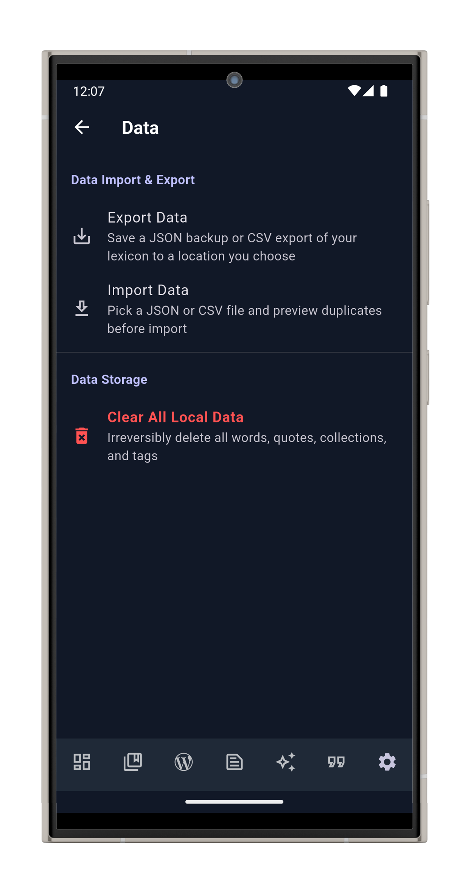

<div align="center">


# My Lexicon

> **Your personal offline dictionary & vocabulary companion — built for privacy.**

[](LICENSE)
[](https://github.com/aryany9/MyLexicon/releases/latest)
[](https://github.com/aryany9/MyLexicon/stargazers)
[](https://github.com/aryany9/MyLexicon/issues)
[](https://flutter.dev)
[](https://github.com/aryany9/MyLexicon/releases)

<br/>

**My Lexicon** is a privacy-first, open-source personal dictionary built with Flutter.
Capture words, phrases, idioms, quotes, and notes — stored **100% locally** on your device.
No account. No internet. No compromise.

<br/>

[](https://github.com/aryany9/MyLexicon/releases/latest)
&nbsp;
[](https://apps.obtainium.imranr.dev/redirect.html?r=obtainium://add/https://github.com/aryany9/MyLexicon)
&nbsp;
[](https://f-droid.org)

</div>

## 📸 Screenshots

<div align="center">
  
  
  
  
  
  
  
  
  
</div>


## ✨ Features

### 📚 Vocabulary Building

| Feature | Description |
|---|---|
| **Custom Dictionary** | Save words, phrases, idioms, quotes, and personal notes with examples and tags |
| **Collections** | Group entries into named collections with membership tracking |
| **Favorites** | Star entries for quick access and filter by favorites across all tabs |
| **Contextual FAB** | Fan-out floating action button adapts to your enabled categories |

### ⚙️ Customization

| Feature | Description |
|---|---|
| **Category Toggles** | Enable/disable Words, Phrases, Idioms, Quotes, or Collections system-wide |
| **Tab Reordering** | Drag-and-drop navigation tab ordering in Settings |
| **Default Launch Tab** | Choose which screen opens when you start the app |
| **Nested Settings** | Clean sub-pages: Appearance · Navigation & Features · Tags · Data |

### 🎨 Display Preferences

| Feature | Description |
|---|---|
| **Per-Tab Sorting** | Sort each category independently: Newest, Oldest, A–Z, Z–A |
| **List Density** | Choose Compact, Comfortable, or Detailed card layouts globally |
| **Material 3 Themes** | Light, dark, and system-default themes with modern Material You design |

### 💾 Data & Privacy

| Feature | Description |
|---|---|
| **Smart Duplicate Detection** | Collection-aware duplicate checks at save-time with inline warnings |
| **JSON Backup & Restore** | One-tap full database export/import with conflict resolution (Skip / Overwrite / Merge) |
| **CSV Exchange** | Export and import entries via CSV, preserving collection structure |
| **Offline-First** | 100% local storage via Hive — no account, no network, no cloud |

---

## 🛠️ Tech Stack

| Layer | Technology |
|---|---|
| **Framework** | Flutter · Dart SDK `^3.12.2` |
| **State Management** | Riverpod (`flutter_riverpod ^2.5.1`) |
| **Navigation** | GoRouter (`go_router ^17.3.0`) |
| **Local Database** | Hive + Hive Flutter |
| **Preferences** | Shared Preferences |
| **File I/O** | `file_picker` · `share_plus` · `path_provider` · `csv` |
| **Internationalization** | `intl` |
| **Target Platform** | Android (Min SDK 21) |

---

## 🗂️ Project Architecture

My Lexicon follows a **feature-first architecture** with **OpenSpec spec-driven development** for structured change management.

```
lib/
├── core/
│   ├── constants/
│   ├── models/           # app_feature.dart, etc.
│   ├── providers/        # feature_flags, sort_order, tab_order, display_prefs
│   ├── services/
│   ├── shell/            # app_shell.dart (ShellRoute host)
│   └── theme/
├── features/
│   ├── collections/
│   ├── dictionary/
│   ├── home/
│   ├── idioms/
│   ├── phrases/
│   ├── quotes/
│   ├── search/
│   └── settings/
│       ├── import_preview_screen.dart
│       ├── settings_screen.dart
│       └── sub_pages/
│           ├── appearance_settings_page.dart
│           ├── data_settings_page.dart
│           ├── navigation_settings_page.dart
│           └── tags_settings_page.dart
├── models/
├── routes/
└── widgets/
```

### OpenSpec Specs (`openspec/specs/`)

Behavioral constraints and system capabilities are formally documented as OpenSpec specs:

| Spec | Description |
|---|---|
| 🧭 `bottom-navigation` | Persistent navigation bar with dynamic items and custom ordering |
| ⚙️ `category-feature-toggles` | System-wide feature flag toggling for all content categories |
| ➕ `contextual-fab` | Dynamic fan-out FAB filtered by active feature flags |
| 🚀 `default-tab-setting` | Configurable launch tab persisted as route path string |
| 🛡️ `duplicate-detection` | Collection-aware duplicate checks and import conflict resolution |
| 🔀 `entry-list-sorting` | Per-tab independent sort preferences |
| 📝 `entry-management` | Full CRUD for entries with notes, tags, and collection assignment |
| 💾 `export-import` | JSON backup/restore and CSV data exchange |
| 📏 `list-density` | Global display density settings |
| ⭐ `organization-favorites` | Favorites marking and filtering |


## 🚀 Getting Started

### Prerequisites

- [Flutter SDK](https://docs.flutter.dev/get-started/install) — Stable channel
- Android Studio / Android SDK (Min SDK 21)

### Setup & Build

**1. Clone the repository**
```bash
git clone https://github.com/aryany9/MyLexicon.git
cd MyLexicon
```

**2. Install dependencies**
```bash
flutter pub get
```

**3. Generate code & icons**
```bash
flutter pub run build_runner build --delete-conflicting-outputs
dart run flutter_launcher_icons
```

**4. Run on a device or emulator**
```bash
flutter run
```

**5. Build release binaries**

```bash
# Android APK
flutter build apk --release

# Android App Bundle (for Play Store)
flutter build appbundle --release
```


## 🤝 Contributing

Contributions are welcome! To get started:

1. **Fork** the repository
2. **Create** a feature branch: `git checkout -b feat/your-feature`
3. **Commit** your changes following [Conventional Commits](https://www.conventionalcommits.org/)
4. **Open** a pull request against `main`

Please ensure your changes:
- Follow the **feature-first** directory layout
- Respect **offline-first** design principles
- Align with existing **OpenSpec** specifications

Found a bug or have a feature idea? [Open an issue](https://github.com/aryany9/MyLexicon/issues) — all feedback is appreciated.


## 📄 License

Licensed under the **Apache License, Version 2.0**.
See [LICENSE](LICENSE) for full details.

---

<div align="center">

Made with ❤️ using Flutter · [⭐ Star this repo](https://github.com/aryany9/MyLexicon) if you find it useful!

</div>